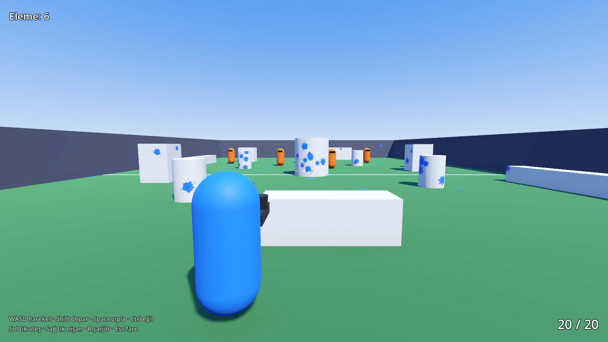

# Splatline

Takım tabanlı, **üçüncü şahıs** (omuz üstü kamera) bir paintball oyunu. Godot 4, Meshy AI ve Blender ile geliştiriliyor.



- İş ve geliştirme planı: [docs/IS_PLANI.md](docs/IS_PLANI.md)
- Aşama durumu: **1. Aşama (prototip) başladı**: hareket, ateş, boya lekeleri ve hedef kuklalar hazır.

## Çalıştırma

1. [Godot 4.6](https://godotengine.org/download) (standart sürüm, .NET gerekmez) indirin.
2. Godot'da **Import** ile bu klasördeki `project.godot` dosyasını açın.
3. **F5** ile oynayın.

| Tuş | Eylem |
|---|---|
| W A S D | Hareket |
| Shift | Depar (yalnızca ileri) |
| Space | Zıpla |
| Ctrl / C | Eğil |
| Sol tık | Ateş |
| Sağ tık | Nişan al (daha isabetli, daha yavaş) |
| R | Şarjör değiştir |
| Esc | Fareyi serbest bırak (tıklayınca geri alınır) |

## Klasör yapısı

```
scenes/        Godot sahneleri (.tscn)
  main/        Arena
  player/      Oyuncu karakteri
  props/       Kuklalar ve diğer nesneler
  weapons/     Boya mermisi
scripts/       GDScript kodu (sahnelerle aynı düzende)
  core/        Takımlar, girdi eşlemeleri
tests/         Ekransız duman testi
tools/         Test ve ekran görüntüsü araçları
docs/          Plan ve görseller
```

## Test

```bash
tools/run_tests.sh
```

Betik gerekirse Godot'u `tools/bin/` altına indirir, projeyi içe aktarır ve `tests/smoke_test.gd` testini çalıştırır. Aynı test her push'ta GitHub Actions üzerinde de çalışır.
